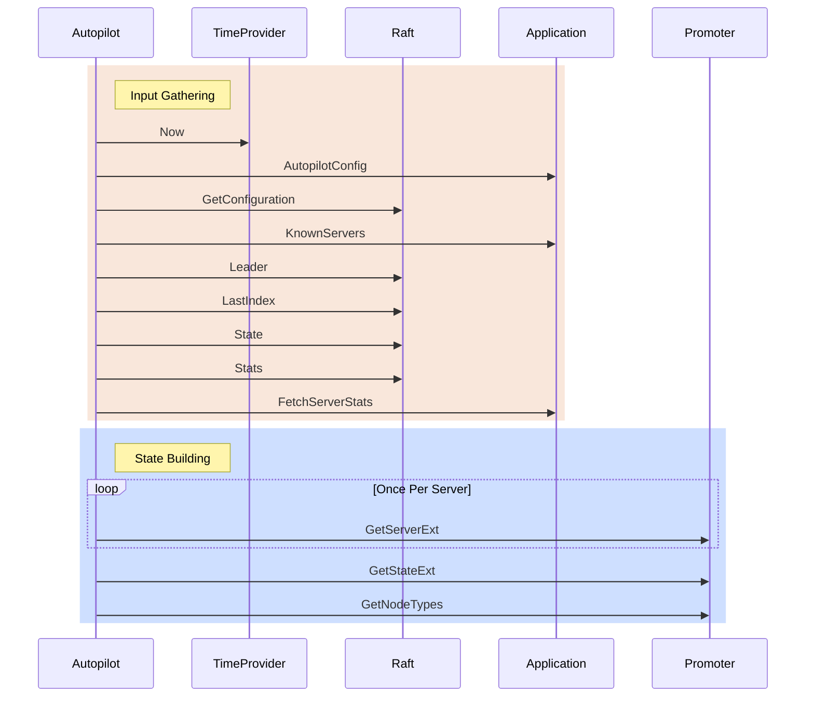

## State Computation

### Terminology

* Application - This is the program/application that is using the raft-autopilot library (e.g Consul or Vault).
* Promoter - An implementation of the Promoter interface such as the `StablePromoter` within this repository.
* Raft - An implementation of the `Raft` interface. In production code this _should_ be a real raft from github.com/hashicorp/raft. This library has an interface for the methods we use to allow better unit testing.

### State Computation Flow

State computation happens automatically when Autopilot is running. The process happens in two phases:
* Input Gathering 
* State Building

During the input gathering phase Autopilot will gather all the inputs it will need to build the state. Then those inputs are consumed in the state building phase to actually put together the current `State`. Things are structured in this manner to allower for better unit testing of the state building. The library tests can provide known inputs and verify that the state is built correctly without having to setup mocks for how that data is retrieved. Similarly we can setup the mocks and assert that the correct set of inputs are gathered correctly without having to infer that they were from the final built state.

State computation relies heavily on external interface implementations:

* `TimeProvider` - Something that has a `Now` method which can be invoked to provide the current time. In tests this can be mocked to allow for stable test output. In production this should almost certainly be left unset and allowed to default to the implementation which uses the stdlib `time.Now()` function.
* `Application` - This is the program/application that is using the raft-autopilot library (e.g. Consul or Vault). The input gathering phase relies on the following methods on the interface:
   * `AutopilotConfig` - We get the autopilot configuration so that we can know which features are enabled and how to determine healthiness.
   * `KnownServers` - The application is responsible for giving us a list of nodes that it thinks should be servers currently.
   * `FetchServerStats` - the servers Autopilot requests the application get stats for are only servers returned by the `KnownServers` call that are reported as alive.
* `Raft` - The Raft interface _should_ always be a real `Raft` from github.com/hashicorp/raft when run in production. For tests, it is convenient to be able to mock out Raft and force it to return specific information without actually needing to run the Raft algorithms. Autopilot relies on the following Raft methods:
   * `GetConfiguration` - Autopilot will get the Raft configuration so that it can reconcile the `Applications` view of the servers as reported by `KnownServers` with `Rafts` current view. Eventually the computed state with information about a servers current suffrage will be used to make decisions regarding promotions and demotions.
   * `Leader` - We are wanting the current leader address to correlate with the servers from `KnownServers`.
   * `LastIndex` - This is mainly used if the local node is the leader. If so then this is the index we use to determine if every other node is up to date.
   * `State` - Used to determine if the local node is the leader.
   * `Stats` - Used to fetch the log term. Only the `last_log_term` key in the stats mapping is used.
* `Promoter` - The promoter interface allows extending autopilot with more complex promotion/demotion algorithms. Some of those may require tracking additional state and so the `Promoter` interface has 3 additional methods that are used for getting the additional information.
   * `GetServerExt` - This gets additional data to be stored on the `ServerState`. The value returned is not used by Autopilot but may be used by the Promoter during future method invocations.
   * `GetStateExt` - This gets additional data to be stored on the whole `State`. The value returned is not used by Autopilot but may be used by the Promoter during future method invocations.
   * `GetNodeTypes` - This method is used so that the Promoter can tell us what shape of thing this server is. The default promoter types *everything* as `voter` as it intends all servers to be voting members of Raft. Other promoter implementations may choose to keep servers as non-voters for reasons and thus may report the node type as something different and more descriptive of the intended use for the server.

#### State Computation Sequence Diagram

The following depicts the ordering of events for how the the `State` gets computed.

